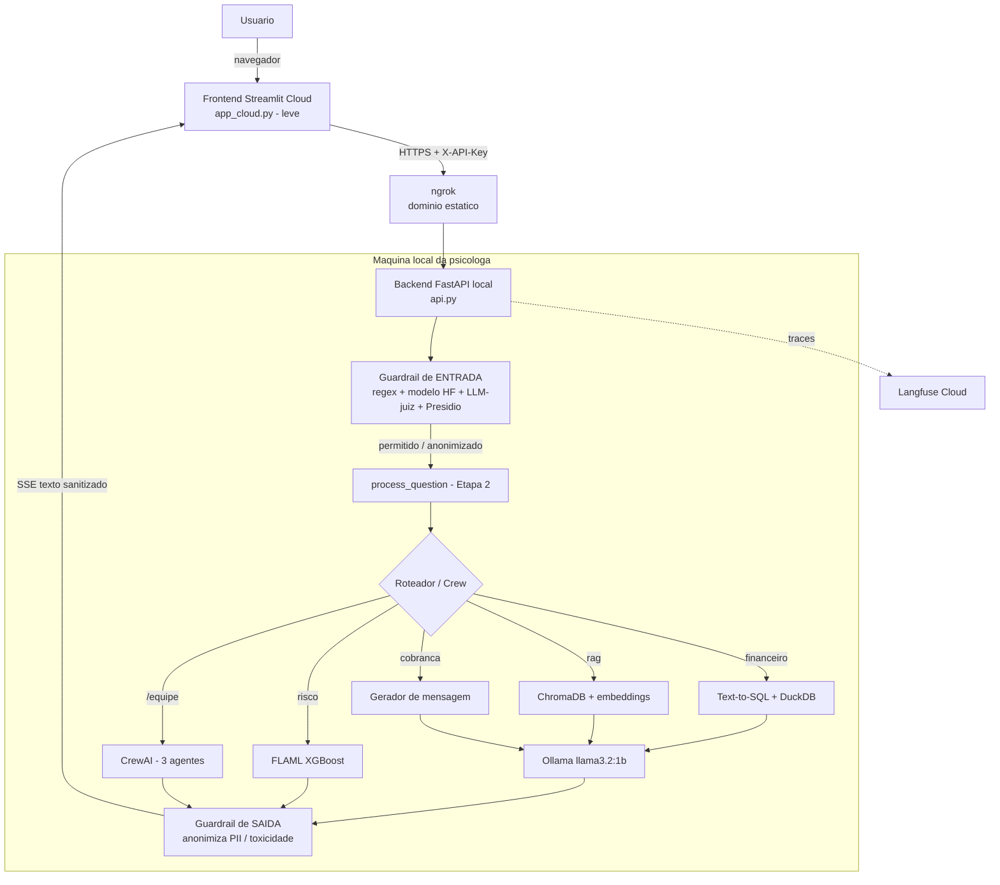

# Assistente de Gestao para Psicologa Clinica

> Projeto da disciplina **AI Factory - Building Intelligent Systems** (PUCPR, 2o ano)

Assistente inteligente que centraliza a gestao de um consultorio de psicologia: consultas
financeiras em linguagem natural, repositorio tecnico via RAG, predicao de risco de
inadimplencia com AutoML, equipe de agentes para tarefas compostas, observabilidade,
avaliacao automatizada e uma camada de seguranca (guardrails) com anonimizacao de PII.

## Demonstracao

- **URL publica (Etapa 3)**: _preencher com a URL do Streamlit Cloud_
- **Video demo (Etapa 3)**: _preencher_
- **Video demo (Etapa 2)**: https://www.youtube.com/watch?v=IyGmePDv7FU

> **Como o deploy funciona:** o frontend (Streamlit) e publicado no **Streamlit Cloud**
> e conversa com um **backend local** (FastAPI) que roda na maquina da psicologa, onde
> ficam o Ollama (LLM) e as dependencias pesadas. O backend e exposto por **ngrok**
> (dominio estatico). Esse desenho mantem o LLM 100% local (sem custo de API) e ainda
> entrega uma URL publica acessivel de qualquer dispositivo. Ver [Arquitetura](#arquitetura)
> e [Publicacao](#publicacao-deploy).

## Challenge-Based Learning (CBL)

- **Grande Ideia**: Gestao inteligente e produtividade tecnologica na psicologia clinica.
- **Pergunta Essencial**: Como a Inteligencia Artificial pode reduzir a carga administrativa e de pesquisa de psicologas autonomas, permitindo que elas foquem integralmente no acolhimento clinico?
- **Desafio**: Construir um Assistente Inteligente para Psicologas que centralize a gestao financeira (prevendo riscos de inadimplencia), automatize a geracao de mensagens de cobranca respeitosas e forneca um repositorio tecnico consultavel via RAG para suporte em sessoes e estudos.
- **Justificativa Pessoal**: Acompanho de perto o dia a dia de uma psicóloga e percebo quanto tempo ela gasta com controle financeiro, cobrança de pacientes e busca em materiais técnicos. Tempo que poderia ser dedicado ao atendimento clínico, estudo da psicologia ou até mesmo descanso. Esse projeto nasceu da vontade de resolver um problema real que vejo acontecer, unindo minha formação em IA com uma necessidade concreta de quem trabalha sozinha na área da saúde mental.

## Funcionalidades

| Funcionalidade | Tecnologia | Etapa | Descricao |
|----------------|------------|-------|-----------|
| Consultas financeiras | DuckDB + Text-to-SQL | 1 | Perguntas em linguagem natural sobre pagamentos, faturamento, inadimplencia |
| Repositorio tecnico | ChromaDB + RAG | 1 | Busca semantica em documentos (DSM-5, TCC, Etica) |
| Cobranca WhatsApp | Ollama | 1 | Geracao de mensagens de cobranca respeitosas |
| Chat com streaming | Streamlit + Ollama | 1 | Interface conversacional com respostas em tempo real |
| Analise de risco | FLAML + UCI dataset | 2 | Classificacao de risco de inadimplencia (XGBoost via AutoML) |
| Equipe de agentes | CrewAI | 2 | 3 agentes especializados para tarefas compostas (`/equipe`) |
| Observabilidade | Langfuse | 2 | Traces, latencia, tokens (cloud) |
| Avaliacao | DeepEval | 2 | 15 perguntas golden + faithfulness/answer_relevancy |
| **Seguranca (guardrails)** | **Presidio + modelos HF + LLM-juiz** | **3** | **Scanners de entrada/saida: injection, jailbreak, toxicidade, topicos proibidos + anonimizacao de PII (pt-BR)** |
| **Deploy hibrido** | **Streamlit Cloud + FastAPI + ngrok** | **3** | **Frontend publico + backend local** |

## Arquitetura



## Stack

- **LLM principal**: Ollama (`llama3.2:1b`) - local, sem API key. Usado em chat, Text-to-SQL, RAG e juiz (DeepEval e guardrails).
- **LLM dos agentes**: Ollama Cloud (`gpt-oss:20b-cloud`, free tier) - usado apenas pelo CrewAI porque function calling exige modelo 7B+.
- **Frontend**: Streamlit (publicado no Streamlit Cloud)
- **Backend**: FastAPI + uvicorn (local), exposto por ngrok
- **Banco estruturado**: DuckDB (OLAP in-process)
- **Banco vetorial**: ChromaDB
- **Embeddings**: sentence-transformers (all-MiniLM-L6-v2)
- **AutoML**: FLAML (XGBoost vencedor)
- **Agentes**: CrewAI
- **Observabilidade**: Langfuse Cloud
- **Avaliacao**: DeepEval (juiz Ollama local)
- **Seguranca**: Presidio (PII) + `protectai/deberta-v3-base-prompt-injection-v2` (HF) + LLM-juiz
- **Linguagem**: Python 3.13

## Seguranca (Guardrails - Etapa 3)

Camada de defesa em profundidade aplicada na **entrada** e na **saida** do assistente
([`src/guardrails.py`](src/guardrails.py)), sem alterar a logica da Etapa 2:

1. **Regex deterministico (PT + EN)** para prompt injection, jailbreak, toxicidade e
   topicos proibidos (orientacao clinica/medica individual). Roda offline, alta precisao.
2. **Modelo HF de prompt injection** (`protectai/deberta-v3-base-prompt-injection-v2`),
   o mesmo que o LLM Guard usa por baixo.
3. **LLM-juiz (llama3.2 local)** como desempate: o modelo HF e treinado em ingles e
   gera falso-positivo em portugues legitimo; o juiz, nativo em PT, confirma antes de
   bloquear, preservando o usuario legitimo.
4. **Presidio** + reconhecedores **pt-BR de CPF e telefone** para anonimizar PII
   (nomes, e-mail, CPF, telefone) na entrada e na saida.

> **Por que nao a biblioteca LLM Guard?** Ela e incompativel com Python 3.13 / `torch 2.11`
> da Etapa 2 (pina `torch==2.0.1`, `transformers==4.38.2`, `sentencepiece==0.2.0`). Usamos
> Presidio + os mesmos modelos HF diretamente, o que a rubrica admite como "equivalente".

Demonstracao reproduzivel (5 ataques bloqueados + PII anonimizada + perguntas legitimas liberadas):

```bash
python tests/test_guardrails.py   # gera evals/guardrails_report.md
```

## Como rodar (local)

### Pre-requisitos

- Python 3.13
- Ollama instalado e rodando (`ollama serve`)
- Modelos: `ollama pull llama3.2:1b` e `ollama pull gpt-oss:20b-cloud` (Ollama Cloud free tier, para a Crew)

### Instalacao

```bash
python -m venv .venv
.venv/Scripts/activate            # Windows  (Linux/Mac: source .venv/bin/activate)

# Backend completo + app local (deps pesadas, inclui guardrails)
pip install -r requirements-backend.txt
python -m spacy download pt_core_news_sm   # modelo PT para o Presidio

cp .env.example .env              # preencha API_KEY, LANGFUSE_* (opcional)

python scripts/generate_data.py   # dados ficticios (uma vez)
python scripts/train_ml_model.py  # treina FLAML sobre UCI (~3 min, uma vez)
```

### Executar

**Opcao A - app local completo (tudo numa interface, sem backend separado):**

```bash
ollama serve            # em outro terminal
streamlit run app.py    # http://localhost:8501
```

**Opcao B - arquitetura de deploy (backend + frontend separados):**

```bash
# Terminal 1: backend
uvicorn api:app --port 8000

# Terminal 2: frontend (aponta para BACKEND_URL no .env)
streamlit run app_cloud.py
```

### Avaliacao e testes

```bash
pip install -r requirements-dev.txt   # adiciona deepeval
python scripts/eval_deepeval.py       # golden dataset (15 perguntas) -> evals/results.md
python tests/test_guardrails.py       # seguranca -> evals/guardrails_report.md
```

## Publicacao (deploy)

O deploy e **hibrido**: frontend na nuvem, backend pesado local. Passos:

1. **Backend local + ngrok** (na maquina da psicologa):
   - Crie um dominio estatico gratuito no [ngrok](https://ngrok.com) e `ngrok config add-authtoken <TOKEN>`.
   - Defina `NGROK_DOMAIN` e `API_KEY` no `.env`.
   - Rode `./scripts/start_public.ps1` (sobe `uvicorn` + `ngrok`). Anote a URL `https://<dominio>.ngrok-free.app`.
2. **Frontend no Streamlit Cloud**:
   - Conecte este repositorio em https://share.streamlit.io e aponte o Main file para `app_cloud.py`.
   - O Streamlit Cloud instala o `requirements.txt` (leve).
   - Em *Secrets*, defina `BACKEND_URL` (a URL do ngrok) e `API_KEY` (o mesmo do backend).
3. Acesse a URL publica do Streamlit Cloud. Com o backend ligado, o chat funciona de qualquer dispositivo.

## Capturas de tela

> _Insira aqui os prints para a entrega:_
> - `docs/screenshots/chat.png` - interface de chat respondendo
> - `docs/screenshots/guardrails.png` - ataque bloqueado / PII anonimizada
> - `docs/screenshots/langfuse.png` - traces no Langfuse

## Limitacoes conhecidas

- **Deploy depende da maquina ligada**: o backend roda localmente; a URL publica so
  responde com a maquina da psicologa ligada e o ngrok ativo (decisao consciente para
  manter o LLM local e sem custo). Caminho de evolucao: hospedar o backend (Ollama
  Cloud/Groq) para ficar sempre no ar.
- **LLM pequeno e local**: o `llama3.2:1b` e rapido mas limitado; respostas podem variar.
- **Cold start dos guardrails**: o modelo HF de injection baixa na primeira execucao e
  roda em CPU (o backend faz `warmup()` no startup para mitigar).
- **Sanitizacao de saida sobre o texto completo**: por causa do streaming, a anonimizacao
  de PII na saida atua apos a geracao (nao token-a-token).
- **Dados sinteticos**: pacientes e financeiro sao ficticios (seed fixa), com codigos
  (PAC-ALPHA) por etica.

## Aviso de IA e etica

Este sistema usa IA generativa. As respostas podem conter erros e **nao substituem o
julgamento profissional**. O assistente e uma ferramenta de **gestao** e nao oferece
orientacao clinica/medica. Nenhum nome real de paciente deve ser inserido; PII detectada
e anonimizada automaticamente.

## Estrutura do Projeto

```
├── app.py                          # App Streamlit local completo (Etapas 1-2 + guardrails)
├── app_cloud.py                    # Frontend leve publicado no Streamlit Cloud (Etapa 3)
├── api.py                          # Backend FastAPI (Etapa 3): guardrails + Etapa 2 via SSE
├── config.py                       # Configuracoes, constantes, system prompt, mensagens
├── data/
│   ├── pacientes.csv               # Dados ficticios de pacientes (etapa 1)
│   ├── financeiro.csv              # Registros financeiros ficticios (etapa 1)
│   └── golden_dataset.json         # 15 perguntas para avaliacao (etapa 2)
├── docs/                           # Documentos para RAG (DSM-5, etica CFP, TCC)
├── entregas/                       # Relatorios por etapa (etapa1/2/3.md)
├── src/
│   ├── database.py                 # DuckDB
│   ├── rag.py                      # ChromaDB
│   ├── llm.py                      # Ollama: chat, Text-to-SQL, RAG
│   ├── ml_model.py                 # Carrega FLAML.pkl, predict_risk
│   ├── agents.py                   # Roteador + agentes especializados
│   ├── crew.py                     # CrewAI: 3 agentes + tools (etapa 2)
│   ├── observability.py            # Wrapper Langfuse (etapa 2)
│   └── guardrails.py               # Camada de seguranca (etapa 3)
├── scripts/
│   ├── generate_data.py            # Gera CSVs ficticios
│   ├── train_ml_model.py           # Treina FLAML sobre UCI (etapa 2)
│   ├── eval_deepeval.py            # Roda golden dataset (etapa 2)
│   └── start_public.ps1            # Sobe backend + ngrok (etapa 3)
├── tests/
│   └── test_guardrails.py          # Demonstracao/teste dos guardrails (etapa 3)
├── .env.example                    # Template de variaveis de ambiente
├── requirements.txt                # Frontend leve (Streamlit Cloud)
├── requirements-backend.txt        # Backend completo (local)
├── requirements-dev.txt            # Ferramentas de avaliacao/teste
├── LICENSE                         # MIT
├── CLAUDE.md                       # Referencia tecnica detalhada
└── README.md
```

## Exemplos de uso

- "Qual o faturamento total do mes de outubro?"
- "Quais pacientes estao inadimplentes?"
- "Qual o risco de inadimplencia do PAC-DELTA?"
- "Gerar mensagem de cobranca para PAC-PHI"
- "O que diz o DSM-5 sobre transtorno de ansiedade?" (requer docs indexados)
- "/equipe quem esta inadimplente e gere as mensagens de cobranca" (CrewAI)

## Licenca

Distribuido sob a licenca MIT. Ver [LICENSE](LICENSE).
